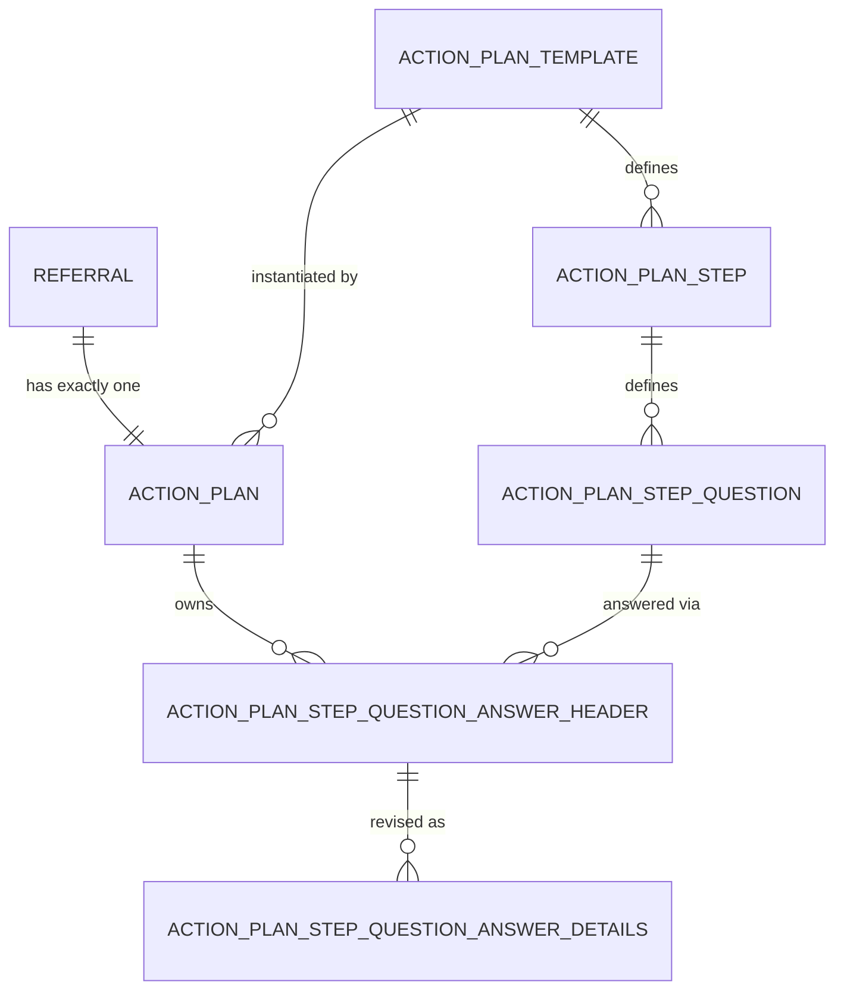

# Design Document: Action Plans

## Scope

This document explains the technical design and implementation of the Action Plan within this project. It exists because the team building it is small, three people, and the cost of a shared misunderstanding is high: parts of this system have already been built, found wanting, and rebuilt. The document is written for both engineers and for the language models that will assist them, so it favours precision over brevity and states explicitly what the code alone cannot.

This is a point-in-time understanding of the Action Plan, and it is subject to change as the product evolves.

## Business Context

### The lifecycle of an Action Plan

Every Referral requires an Action Plan, and every Referral has exactly one. Referrals are created by Probation Practitioners; Action Plans are created and maintained by individuals at a Delivery Partner organisation, a distinct group of users with distinct responsibilities.

The lifecycle runs as follows:

- An empty Action Plan is created automatically the moment a Referral is **Submitted**. Delivery Partners have no access to the Action Plan before this point.
- Once created, the Action Plan can be edited freely, by anyone, for an indeterminate stretch of time. Alice may start it; Bob may finish it the next day. There is no ownership lock.
- The Action Plan can only be **Submitted** once the Service User has attended a pre-scheduled Initial Contact Session (ICS) and feedback against that session has itself been submitted. The ICS journey is a sibling to the Action Plan and outside the scope of this document.
- Submission does not close the Action Plan. Editing continues afterward, because needs are not fixed at a point in time. A Service User referred in January might submit an Action Plan by month's end, then lose their accommodation in March. That is a new need, and the Action Plan must absorb it without ceremony.

### What is in an Action Plan

An Action Plan describes what a Delivery Partner will do to support a Service User, and how. Its content is built around **Needs**: a fixed, contractually significant list of criminogenic needs, identical for every Referral regardless of geography, offence, or personal characteristic. The list is seeded as static reference data (see [V025__seed_need_reference_data.sql](../src/main/resources/db/seed/V025__seed_need_reference_data.sql)) and currently comprises:

- Accommodation
- Employment and education
- Finances
- Drug use
- Alcohol use
- Health and wellbeing
- Personal relationships and community
- Thinking, behaviours and attitudes

Against any number of these Needs, a Delivery Partner records any number of **Outcomes**. An Action Plan is not valid until it holds at least one Outcome against at least one Need, though most will hold many more. An Outcome names a concrete goal, such as securing emergency accommodation through a local charity. The term **Goal** appears in some documentation inherited from the Sentence Plan team; treat it as a synonym, but prefer Outcome in this codebase.

Alongside each Outcome sits its **Delivery**: the practical mechanics of how the Delivery Partner intends to meet it, for instance fortnightly in-person check-ins or twice-weekly phone calls.

### Activities: not yet built, but already named

One layer of the Action Plan is settled in thinking well before it is settled in code: the **Activity**. Where an Outcome states what is being aimed for, an Activity states what will actually be done to get there, logged against one specific Outcome. Outcomes are expected to be chosen from a fixed, predetermined list once its content and design work is finished; Activities, by contrast, are expected to be free text, since the concrete steps a Provider commits to will vary by case in a way a fixed list cannot anticipate.

An Activity earns its place for three reasons. It turns intent into a checkable set of things to do. It gives the Service User's record visible evidence of progress or motion. And it directs the Provider, or a sub-provider delivering on the Provider's behalf, in what they are actually expected to do next.

The complication sits in the link between an Activity and the Outcome it serves. An Outcome, as established, is not fixed once written; it can be reworded, or dropped, as an Action Plan is revised. Needs themselves are not fixed in importance either: e.g. a Service User's housing or drug situation can deteriorate sharply, and a Need that was minor becomes urgent. An Activity can therefore outlive the Outcome it was logged against, left pointing at something reworded out from under it, or at a Need whose priority has since moved so far that the Activity no longer matches the scale of the problem. No validation logic exists yet to detect or resolve this, and none is planned immediately. It is named here so that whoever eventually builds it inherits the problem on purpose, not by surprise.

### Open question: how much structure does progress deserve?

There is no settled answer yet to how feedback or progress against an Outcome should be recorded, and the two poles of the debate are worth stating plainly.

A **structured** model would extend the Need → Outcome chain into Need → Outcome → Activity → Completion, giving the business concrete, queryable evidence: the proportion of Activities marked complete, for example. End users report that they want this kind of granularity. But it is expensive to build and to maintain. It demands new screens, and it forces the team to answer workflow questions it would rather avoid, such as whether an Action Plan can be completed while Activities remain outstanding. Experience suggests that systems which grant caseworkers more discretion, rather than less, tend to cause fewer problems in practice.

An **unstructured** model keeps the Need → Outcome shape but reduces progress tracking to something like a comment field: a single editable textbox, or an append-only log. This is far cheaper to build, but it yields data that resists aggregation. Answering a question like "what percentage of completed Action Plans in Region X, for Provider A, evidenced at least 90% completion of their Outcomes?" becomes difficult or impossible.

This tension, between reporting fidelity and delivery cost, is unresolved, and it directly shapes the entity design that follows.

## Entity Relationships

Before the prose, the shape: a Referral has exactly one Action Plan, built from a shared Template, broken into Steps, each holding Questions, each Question answered through the Header/Detail pattern described below.

## Technical Design

The Action Plan is implemented, at root, as a set of questions and the responses given to them. Modelling it this way lets the API drive the shape of the Action Plan rather than leaving that judgement to whichever UI happens to render it.

### Template, Step, and Question

A single [`ActionPlanTemplate`](../src/main/kotlin/uk/gov/justice/digital/hmpps/communitysupportapi/entity/ActionPlanTemplate.kt) defines what questions exist and in what order they are asked. At present every Action Plan is built from the same template, and the `activeGlobal` flag marks the one template instance currently in force. This is deliberately a design for a single global template, not an accident of scope: nothing about the model prevents variation between templates, but nothing today requires it either.

A Template owns many [`ActionPlanStep`](../src/main/kotlin/uk/gov/justice/digital/hmpps/communitysupportapi/entity/ActionPlanStep.kt)s: coarse, human-legible groupings of related questions, each corresponding roughly to a screen in the UI. The `stepType` enum currently distinguishes `NEED`, `SESSION_DELIVERY`, and `CATCH_ALL`, though only the first two are in active use; `CATCH_ALL` exists as a deliberate escape hatch for content that does not yet belong to a more specific step.

Each Step holds an ordered list of [`ActionPlanStepQuestion`](../src/main/kotlin/uk/gov/justice/digital/hmpps/communitysupportapi/entity/ActionPlanStepQuestion.kt)s, the unit that actually solicits information from a Delivery Partner. Two aspects of a Question deserve particular attention:

1. **Its relationship to a Need.** A Question may carry an optional `needId`, linking it to one row in the static `need` table. When a Question is answered under that link, the Delivery Partner is identifying an Outcome against that Need, in the terms of the business context above. The `questionType` field (`OUTCOME` or `GENERAL`) records whether a Question is of this Need-oriented, Outcome-producing kind, or whether it is a general question with no such attachment, such as the logistics captured in the Session Delivery step.
2. **Its cardinality.** A single Question can receive more than one answer. This covers two distinct cases: a Delivery Partner identifying several Outcomes against one Need, and a multiple-choice Question, particularly common in Session Delivery, where several `choices` may be selected at once. The `maxNumberResponses` field bounds how many answers a Question will accept, and the `answerType` enum (`TEXTAREA`, `RADIO`, `CHECKBOX`) determines how a single answer is captured and rendered.

Together, Template, Step, Question, and Need form the skeleton of the Action Plan: a fixed structure of what can be asked, onto which the actual answers, and their history, are recorded separately.

### The Action Plan record itself

The [`ActionPlan`](../src/main/kotlin/uk/gov/justice/digital/hmpps/communitysupportapi/entity/ActionPlan.kt) entity is the record that actually belongs to a Referral. It is created by `ActionPlan.forReferral`, one row per Referral, pinned to whichever Template is active at creation time. Notice what it does not have: a `status` column. Its lifecycle is instead a log. Each transition writes an [`ActionPlanEvent`](../src/main/kotlin/uk/gov/justice/digital/hmpps/communitysupportapi/entity/ActionPlanEvent.kt), currently either `CREATED` or `SUBMITTED`, and `ActionPlan.isSubmitted()` answers by asking whether a `SUBMITTED` event has ever been appended, not by reading a flag that could be overwritten.

This event-sourced shape is a direct, deliberate answer to a requirement stated in the business context above: submission does not close an Action Plan, and further edits after submission must not undo the fact that it was once submitted. A boolean or enum status column would have to be carefully guarded against being reset by a later edit. A log cannot be un-appended to. The `SUBMITTED` event stays true forever once it exists, regardless of what happens to the Action Plan afterward.

### Recording answers: Header and Details

**TL;DR:** every individual answer, one Outcome, one ticked choice, gets its own Header row. Changing the wording of an existing answer never overwrites it: it adds a new Detail row underneath the same Header, so every past version survives. Removing an answer never deletes it either: the Header is marked `deletedAt`/`deletedBy`, not dropped from the table. To find "the current answer", take every Header that has not been soft-deleted, and read its most recent Detail. If a change updates a Detail in place, or hard-deletes a Header, it is not using this pattern.

The Header/Detail split, [`ActionPlanStepQuestionAnswerHeader`](../src/main/kotlin/uk/gov/justice/digital/hmpps/communitysupportapi/entity/ActionPlanStepQuestionAnswerHeader.kt) and [`ActionPlanStepQuestionAnswerDetails`](../src/main/kotlin/uk/gov/justice/digital/hmpps/communitysupportapi/entity/ActionPlanStepQuestionAnswerDetails.kt), exists to satisfy two requirements from the business context at once: a full historic log of every answer ever given, and the ability to absorb ad hoc changes to an Action Plan after it has been agreed (submitted; the two terms are used interchangeably here).

A Header does not represent a Question. It represents one specific answer to a Question, and a Question that accepts several responses will stand beside several Headers, not one. 

Take the housing example: a Question of type `OUTCOME`, tied to the Accommodation Need, might receive two distinct Outcomes from a Delivery Partner, getting on the waiting list for social housing, and speaking to a local housing charity. Each Outcome is its own Header, both pointing at the same Question, distinguished by `orderNumber`. Each Header owns one or more Details: the first written when the Outcome is recorde, whenever the wording of that specific Outcome is changed. The Header's identity never moves; only its Details accumulate underneath it. This is how the system keeps a complete log without losing track of which historic wording belongs to which distinct Outcome.

Multiple-choice Questions in the Session Delivery step follow the same rule, with one addition. Each selected [`ActionPlanStepQuestionChoice`](../src/main/kotlin/uk/gov/justice/digital/hmpps/communitysupportapi/entity/ActionPlanStepQuestionChoice.kt) becomes its own Header against the Question, with a Detail recording that specific choice as submitted. Because a set of selections can change between one save and the next, a Header here also stands for "this choice is currently selected", which means a Header must be retractable as well as extendable. That is what the `deletedAt` and `deletedBy` columns on `ActionPlanStepQuestionAnswerHeader` are for: they mark a Header as no longer live without erasing the record of it having once existed.

Walk through the case that motivates this. A Question offers four options, A, B, C, and D. A Delivery Partner first selects A and B, and the save writes two Headers, one per choice, each with its own first Detail. Later, they return and change the selection to A and C. On that second save:

- **A remains selected.** Its Header is untouched. A new Detail row is added beneath it, at the next `revisionNumber`, recording that the choice was reaffirmed on this later save, distinguishing that fact from simply having been left over from before.
- **B is no longer selected.** Its Header is soft-deleted: `deletedAt` and `deletedBy` are populated, but the Header and its Detail history stay in the table. The record that B was once chosen, and later withdrawn, is preserved rather than lost.
- **C is newly selected.** A fresh Header is created for it, carrying its own first Detail.

Because a Header, not a Detail, is the unit that gets added, kept, or retracted, this pattern gives the Action Plan a audit trail: what was selected, when it changed, and by whom, across however many times a Delivery Partner revises it, whether that revision happens before or after the Action Plan is submitted.

There is therefore some complexity in finding the current answers to questions in a way that makes sense for an end user, rather than a database schema. The [`ActionPlanStepQuestionAnswerDetailsRepository`](../src/main/kotlin/uk/gov/justice/digital/hmpps/communitysupportapi/repository/ActionPlanStepQuestionAnswerDetailsRepository.kt) does exactly this: its native queries select `DISTINCT ON` the Header, ordered by revision, against Headers where `deleted_at IS NULL`, so a caller gets the current answer set, one row per live Header, without needing to know anything about the history sitting underneath it.

### An unresolved thread: ActionPlanActivity

The [`ActionPlanActivity`](../src/main/kotlin/uk/gov/justice/digital/hmpps/communitysupportapi/entity/ActionPlanActivity.kt) entity is worth flagging on its own, because it is not yet connected to anything. It exists as a table (`V034__create_action_plan_activity_table.sql`) and as a JPA entity, constrained at the database level to attach only to Questions of type `OUTCOME`, and it carries exactly the shape you would expect of the Activity described in the business context above: `who` is responsible, what the `activityDetails` are, and a `status`. No repository, service, or controller in this codebase reads or writes it. 

It looks like the first concrete step toward the Need → Outcome → Activity → Completion model, begun and then set aside before the rest of the chain, the wiring to a repository, an endpoint, a place in the response DTOs, was built. 

Anyone picking this up should treat it as neither finished nor safe to ignore: either complete the path to make it live, or remove it so it stops implying a feature that does not yet work. Note too that its schema has no answer to the outdated-Outcome problem raised above; the foreign key points only at the Question, not at any particular live Header, so nothing here yet guards against an Activity outliving the Outcome it was logged against.

### Two things called "Need"

The word "Need" names two unrelated structures in this codebase, and the overlap is a plausible source of the confusion this document exists to dispel. The [`Need`](../src/main/kotlin/uk/gov/justice/digital/hmpps/communitysupportapi/entity/Need.kt) entity described earlier belongs to the Action Plan: eight static rows, referenced from an `ActionPlanStepQuestion`, answered by a Delivery Partner after the Referral has been submitted.

[`ReferralCriminogenicNeeds`](../src/main/kotlin/uk/gov/justice/digital/hmpps/communitysupportapi/entity/ReferralCriminogenicNeeds.kt) is a separate entity entirely, one row per Referral, holding a `has*Needs` boolean and a free-text `*Details` field for each of the same eight categories. It is written by a Probation Practitioner while still drafting the Referral, through `CriminogenicNeedsService` and `DraftReferralController`, and it feeds the Referral's task-list completion status. It shares no foreign key, no table, and no code path with the Action Plan's `Need` entity. The two structures happen to describe the same eight named categories because both are drawing on the same contractual list of criminogenic needs, but they are independent implementations, capturing independent judgements made by different people at different stages of the Referral's life. Do not follow a reference to one expecting it to lead to the other.

## Code Review Checklist

This document exists because the Header/Detail pattern has already been reinvented, by accident, more than once. The questions below are for reviewing a change (human or LLM) against that risk (i.e. does this code quietly introduce a second way of modelling the same thing?)

Flag the change if any of the following are true.

**It bypasses the append-only history.**
- [ ] It runs an `UPDATE` against `ActionPlanStepQuestionAnswerDetails` (or calls `.save()` on a fetched Details entity) instead of inserting a new row at the next `revisionNumber`.
- [ ] It hard-deletes an `ActionPlanStepQuestionAnswerHeader` row, rather than setting `deletedAt` and `deletedBy`.
- [ ] It adds a `current` / `isLatest` / `active` boolean column to Header or Details, duplicating what "no soft-delete, highest revision number" already tells you.

**It misunderstands what a Header is.**
- [ ] It assumes, in code, comments, or a data model, that a Question has one Header. A Question with multiple responses has multiple Headers, one per distinct answer or selected choice.
- [ ] It adds a new join, table, or field to represent "which choices are currently selected" for a multiple-choice Question, instead of relying on which Headers exist and are not soft-deleted.

**It builds a second history mechanism.**
- [ ] It introduces a new audit table, changelog, or event stream to track changes to an answer, when the Header/Detail split already is that mechanism.
- [ ] It computes "the current answer to this Question" with new ad hoc SQL or in-memory sorting, rather than going through (or extending) [`ActionPlanStepQuestionAnswerDetailsRepository`](../src/main/kotlin/uk/gov/justice/digital/hmpps/communitysupportapi/repository/ActionPlanStepQuestionAnswerDetailsRepository.kt)'s existing `DISTINCT ON` queries.

**It gives the Action Plan a status column.**
- [ ] It adds a `status` or `state` field to `ActionPlan` to track submission, instead of appending an `ActionPlanEvent`. Submission is a fact in a log, not a flag that can be read back to a prior value.

**It reinvents "Need".**
- [ ] It adds a new set of boolean or free-text fields to represent the eight criminogenic Need categories, rather than referencing the existing [`Need`](../src/main/kotlin/uk/gov/justice/digital/hmpps/communitysupportapi/entity/Need.kt) reference data. `ReferralCriminogenicNeeds` already made this mistake's sibling once; a third version is not needed.

**It touches `ActionPlanActivity` without addressing its known gap.**
- [ ] It wires `ActionPlanActivity` into a repository, service, or endpoint without also handling, or explicitly deferring in a tracked ticket, what happens when the Outcome it points at is later reworded, soft-deleted, or superseded by a more urgent Need.

If a change trips one of these and there is a genuine reason for it, that reason belongs in this document, not just in the pull request description.

